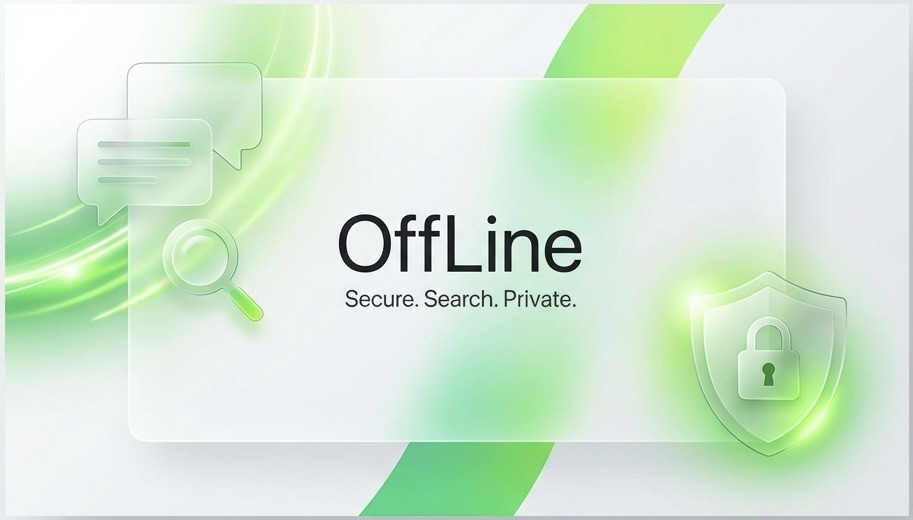

# OffLine

一個注重隱私、完全離線的 LINE 聊天記錄搜尋與瀏覽工具。



## ✨ 特色功能

-   **🔒 完全離線**：所有解析與搜尋皆在瀏覽器端完成，您的聊天記錄絕不會上傳至任何伺服器。
-   **🎨 Apple 風格介面**：採用 Glassmorphism (毛玻璃) 效果、San Francisco 字體與圓角設計，提供原生般的質感。
-   **⚡ 高效能**：支援大型聊天記錄檔案 (數十萬則訊息)，使用虛擬捲動 (Virtual Scrolling) 確保流暢度。
-   **🔍 強大搜尋**：
    -   關鍵字即時搜尋
    -   多選發言人過濾
    -   日期範圍篩選
    -   模糊搜尋發言人列表
-   **📱 PWA 支援**：可安裝至桌面或手機，並支援離線開啟使用。
-   **💬 氣泡對話模式**：還原真實聊天室體驗，支援動態高度與自動排版。
-   **🖱️ 拖曳側邊欄**：可自訂調整側邊欄寬度，適應不同瀏覽需求。

## 🛠️ 技術棧

-   **核心框架**: React 18, TypeScript
-   **建置工具**: Vite
-   **PWA**: vite-plugin-pwa
-   **虛擬列表**: react-window (VariableSizeList)
-   **測試**: Vitest, React Testing Library
-   **樣式**: Native CSS Variables (CSS Modules concept), Glassmorphism

## 🚀 快速開始

### 前置需求

-   Node.js (v16+)
-   npm 或 yarn

### 安裝與執行

1.  複製專案
    ```bash
    git clone https://github.com/beckxie/OffLine.git
    cd OffLine
    ```

2.  安裝依賴
    ```bash
    npm install
    ```

3.  啟動開發伺服器
    ```bash
    npm run dev
    ```

4.  建置正式版本
    ```bash
    npm run build
    ```

## 📖 如何匯出 LINE 聊天記錄

1.  進入 LINE 聊天室。
2.  點擊右上角選單 (≡)。
3.  選擇「其他設定」>「傳送聊天記錄」。
4.  選擇「以文字檔傳送」。
5.  將下載的 `.txt` 檔案拖放至本應用程式即可。

## 🔒 隱私與安全驗證

我們理解您對聊天記錄隱私的重視。您可以透過以下方式驗證本應用程式的安全性：

1.  **斷網測試**：
    您可以在載入網站後，**完全切斷網路連線 (開啟飛航模式)**。接著嘗試上傳檔案與搜尋，您會發現所有功能依然正常運作。這證明了資料處理完全在您的裝置上進行，沒有傳送至雲端。
2.  **開源透明**：
    本專案為開源軟體，所有程式碼皆公開在 GitHub 上。具備技術背景的使用者可以檢視原始碼，確認沒有任何將資料上傳至伺服器的程式碼。
3.  **網路監測**：
    使用瀏覽器的開發者工具 (F12) > Network 頁籤。在上傳檔案時，您不會看到任何對外的 API 請求 (POST/PUT)。

## 📄 License

This project is licensed under the **[CC BY-NC-SA 4.0](https://creativecommons.org/licenses/by-nc-sa/4.0/)** (Attribution-NonCommercial-ShareAlike 4.0 International).
